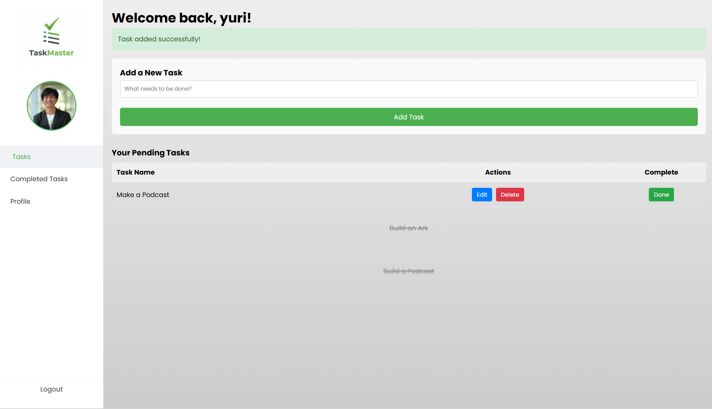
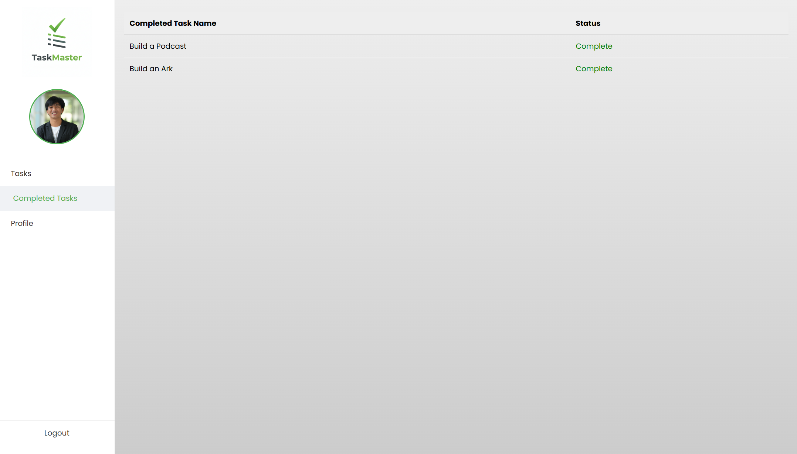
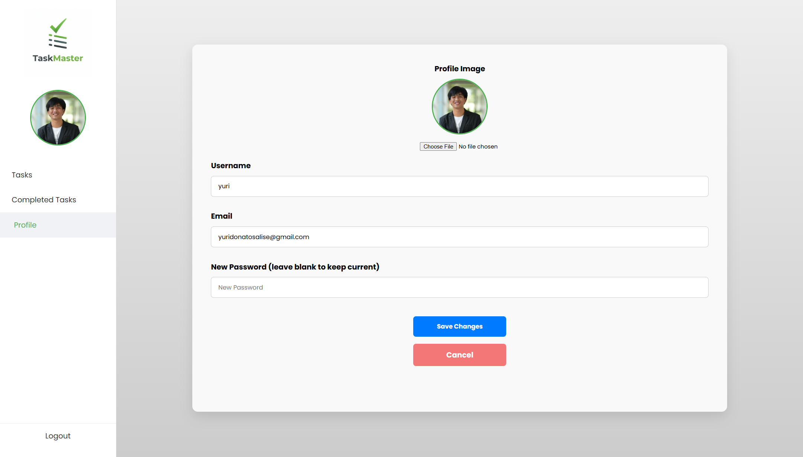

## Project Overview (Education Purpose)
TaskMaster allows users to register, manage a personal profile, and organize their daily tasks through a clean, intuitive dashboard.

### Key Features
User Authentication: Secure registration and login system with "Remember Me" functionality.

Task Management (CRUD):

Create: Add new tasks via the dashboard.

Read: View lists of pending and completed tasks.

Update: Edit task titles or mark them as complete.

Delete: Remove tasks from the database.

Profile Customization: Users can update their username, email, password, and upload a profile image.

Blade Components: Utilizes a modular layout system with <x-layout> and <x-sidebar> for consistent UI across all pages.

## Technical Stack
Backend: Laravel (PHP)

Frontend: CSS (External/In-line), HTML

Database: Eloquent ORM (SQLite)

Security: CSRF Protection, Password Hashing (Bcrypt), and Session management

## Screenshots (Preview)
Dashboard Page:

Completed Tasks Page:

Profile Page:

## Educational Concepts Demonstrated
1. Component-Based Architecture
The project uses Blade Components. Instead of repeating the HTML head and navigation on every page, the app wraps content in <x-layout> or <x-sidebar> tags, making the code DRY (Don't Repeat Yourself).

2. Authentication Flow
The AuthController demonstrates:

Validation: Ensuring unique emails and minimum password lengths.
Hashing: Using Hash::make to never store plain-text passwords.
Sessions: Persisting user data across different pages.

3. Database Relationships
The app structures data so that tasks are associated with specific users, ensuring that your dashboard only shows your tasks.
